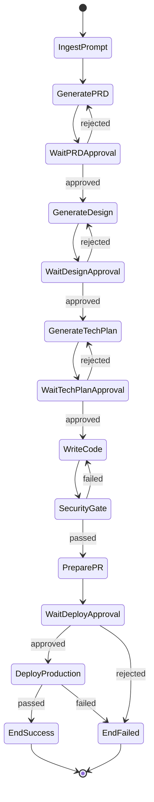

# ID8 Orchestrator State Machine (MVP v2)

## Overview
This state machine is the source of truth for run progression, approval gates, retries, and resumability.

## Node Graph

## Node Contracts
1. `IngestPrompt`
Input: project id, prompt, constraints.
Output: `prd` generation task payload.

2. `GeneratePRD`
Input: prompt payload.
Output: `prd` artifact version n.
Failure: retry up to max attempts with backoff.

3. `WaitPRDApproval`
Input: latest `prd` artifact.
Transition: wait for approval event.

4. `GenerateDesign`
Input: approved PRD + design provider.
Output: `design_spec` artifact version n.
Providers: primary `stitch_mcp`, fallback `internal_spec`.

5. `WaitDesignApproval`
Input: `design_spec`.
Transition: wait for approval/feedback event.

6. `GenerateTechPlan`
Input: approved PRD and design.
Output: `tech_plan` artifact version n.

7. `WaitTechPlanApproval`
Input: `tech_plan`.
Transition: wait for approval event.

8. `WriteCode`
Input: approved artifacts.
Output: `code_snapshot` artifact version n.

9. `SecurityGate`
Input: latest `code_snapshot`.
Output: `security_report` artifact.
Rule: unresolved high/critical findings block progression.

10. `PreparePR`
Input: code snapshot + repo metadata.
Output: branch, pull request url, check statuses.
Rule: direct push to main is not allowed.

11. `WaitDeployApproval`
Input: merge and security status.
Transition: wait for `stage=deploy` approval event.

12. `DeployProduction`
Input: deploy approval + merged code.
Output: `deploy_report` artifact + live url.

13. `EndSuccess`
Terminal success node.

14. `EndFailed`
Terminal failure node with resumable metadata.

## Resume Rules
1. Resume always starts from last successful node.
2. Nodes are idempotent by `run_id` + `node_name` + optional idempotency key.
3. Failure payload must include provider error class and retryability.

## Retry Policy
1. Provider transient errors: retry with exponential backoff (3s, 9s, 27s, jitter).
2. Model rate-limit errors: retry with budget-aware delay and fallback profile.
3. Non-retryable policy violations: fail fast to `EndFailed`.
